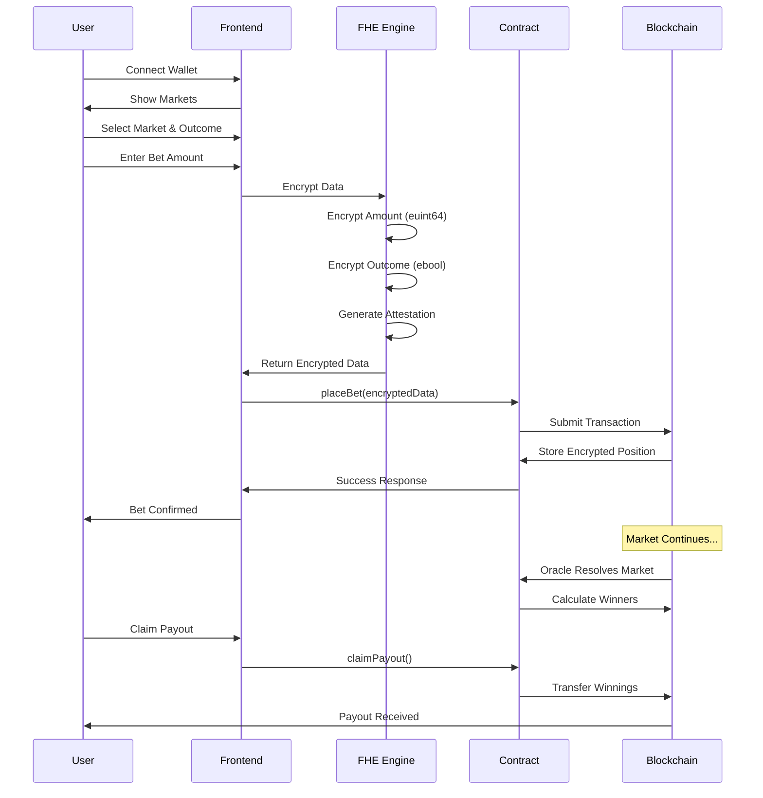
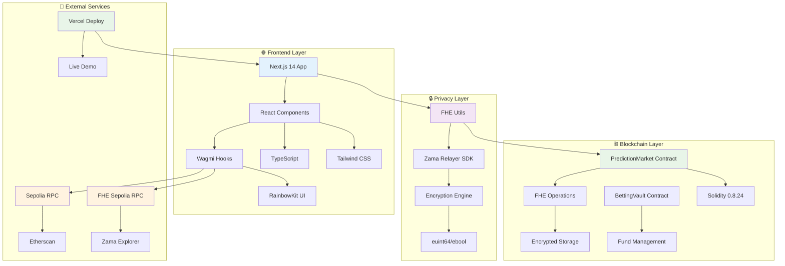
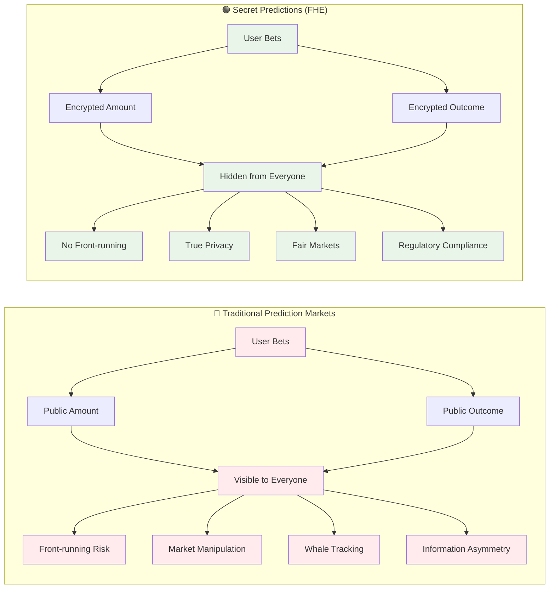

# Secret Predictions - Privacy-Preserving Prediction Markets

A decentralized prediction market platform built with **Zama FHEVM** (Fully Homomorphic Encryption Virtual Machine) that enables private betting on market outcomes while maintaining complete confidentiality of user positions and amounts.

## 🌐 Live Demo

**Try it now:** [https://secretpred-qxjx.vercel.app/](https://secretpred-qxjx.vercel.app/)

- Connect your wallet to Sepolia testnet
- Browse featured prediction markets
- Place encrypted bets with privacy
- Experience the future of decentralized prediction markets

## 🔄 How Betting Works

### Visual Betting Flow

```
┌─────────────────┐    ┌─────────────────┐    ┌─────────────────┐
│   🔐 WALLET     │───▶│   📊 BROWSE     │───▶│   🎯 SELECT     │
│   CONNECTION    │    │   MARKETS       │    │   OUTCOME       │
└─────────────────┘    └─────────────────┘    └─────────────────┘
                                                        │
                                                        ▼
┌─────────────────┐    ┌─────────────────┐    ┌─────────────────┐
│   💸 CLAIM      │◀───│   🏁 RESOLVE    │◀───│   ⏰ WAIT FOR   │
│   PAYOUTS       │    │   MARKET        │    │   RESOLUTION    │
└─────────────────┘    └─────────────────┘    └─────────────────┘
        ▲                                              │
        │                                              ▼
┌─────────────────┐    ┌─────────────────┐    ┌─────────────────┐
│   💾 ENCRYPTED  │◀───│   📝 SMART      │◀───│   🔒 FHE        │
│   STORAGE       │    │   CONTRACT      │    │   ENCRYPTION    │
└─────────────────┘    └─────────────────┘    └─────────────────┘
        ▲                                              │
        │                                              ▼
┌─────────────────┐    ┌─────────────────┐    ┌─────────────────┐
│   💰 ENTER      │───▶│   🔐 ENCRYPT    │───▶│   📤 SEND TO    │
│   AMOUNT        │    │   DATA          │    │   BLOCKCHAIN    │
└─────────────────┘    └─────────────────┘    └─────────────────┘
```

### Detailed Process Flow


```mermaid
sequenceDiagram
    participant U as User
    participant F as Frontend
    participant FHE as FHE Engine
    participant C as Contract
    participant B as Blockchain
    
    U->>F: Connect Wallet
    F->>U: Show Markets
    U->>F: Select Market & Outcome
    U->>F: Enter Bet Amount
    F->>FHE: Encrypt Data
    FHE->>FHE: Encrypt Amount (euint64)
    FHE->>FHE: Encrypt Outcome (ebool)
    FHE->>FHE: Generate Attestation
    FHE->>F: Return Encrypted Data
    F->>C: placeBet(encryptedData)
    C->>B: Submit Transaction
    B->>C: Store Encrypted Position
    C->>F: Success Response
    F->>U: Bet Confirmed
    
    Note over B: Market Continues...
    
    B->>C: Oracle Resolves Market
    C->>B: Calculate Winners
    U->>F: Claim Payout
    F->>C: claimPayout()
    C->>B: Transfer Winnings
    B->>U: Payout Received
```

### Privacy-Preserving Betting Flow

1. **🔐 Wallet Connection**: User connects Web3 wallet to Sepolia testnet
2. **📊 Market Selection**: Browse and select from featured prediction markets
3. **🎯 Outcome Choice**: Choose YES or NO for the market outcome
4. **💰 Amount Input**: Enter bet amount in ETH
5. **🔒 FHE Encryption**: 
   - Amount encrypted using `euint64`
   - Outcome encrypted using `ebool`
   - Attestation proof generated
6. **📝 Smart Contract**: Encrypted data sent to blockchain
7. **💾 Storage**: Encrypted position stored on-chain
8. **⏰ Waiting**: Market continues until resolution time
9. **🏁 Resolution**: Oracle resolves market with final outcome
10. **💸 Payout**: Winners can claim their encrypted payouts

## 🚀 Features

- **🔒 Privacy-Preserving Bets**: All betting amounts and outcomes remain encrypted until market resolution
- **🎯 Real-Time Markets**: Create and participate in prediction markets with real-time updates
- **💰 Secure Payouts**: Automated payout system for winning positions
- **🌐 Modern UI**: Beautiful, responsive interface built with Next.js and Tailwind CSS
- **🔗 Web3 Integration**: Seamless wallet connection with RainbowKit and Wagmi

## 🛠️ Technology Stack

### Frontend
- **Next.js 14** - React framework with App Router
- **TypeScript** - Type-safe development
- **Tailwind CSS** - Utility-first CSS framework
- **Radix UI** - Accessible component primitives
- **Lucide React** - Beautiful icons

### Web3 & Blockchain
- **Wagmi** - React hooks for Ethereum
- **RainbowKit** - Wallet connection UI
- **Viem** - TypeScript interface for Ethereum
- **Hardhat** - Ethereum development environment
- **Ethers.js** - Ethereum library

### Privacy & Encryption
- **Zama FHEVM** - Fully Homomorphic Encryption Virtual Machine
- **@zama-fhe/relayer-sdk** - Zama Relayer SDK for FHE operations
- **@fhevm/solidity** - FHE-enabled Solidity contracts

### Smart Contracts
- **Solidity 0.8.24** - Smart contract language
- **OpenZeppelin** - Secure contract libraries
- **FHE Types**: `euint64`, `ebool`, `externalEuint64`, `externalEbool`

## 🏗️ System Architecture

### High-Level Architecture

```
┌─────────────────────────────────────────────────────────────────┐
│                        FRONTEND LAYER                           │
├─────────────────────────────────────────────────────────────────┤
│  ┌─────────────┐  ┌─────────────┐  ┌─────────────┐             │
│  │   Next.js   │  │   React     │  │  RainbowKit │             │
│  │     App     │  │ Components  │  │     UI      │             │
│  └─────────────┘  └─────────────┘  └─────────────┘             │
│         │                │                │                     │
│         └────────────────┼────────────────┘                     │
│                          │                                     │
│                    ┌─────────────┐                             │
│                    │   Wagmi     │                             │
│                    │   Hooks     │                             │
│                    └─────────────┘                             │
└─────────────────────────┬───────────────────────────────────────┘
                          │
┌─────────────────────────┼───────────────────────────────────────┐
│                    PRIVACY LAYER                                │
├─────────────────────────┼───────────────────────────────────────┤
│  ┌─────────────┐  ┌─────────────┐  ┌─────────────┐             │
│  │   FHE       │  │   Zama      │  │ Encryption  │             │
│  │  Utils      │  │  Relayer    │  │  Engine     │             │
│  │             │  │    SDK      │  │             │             │
│  └─────────────┘  └─────────────┘  └─────────────┘             │
└─────────────────────────┬───────────────────────────────────────┘
                          │
┌─────────────────────────┼───────────────────────────────────────┐
│                    BLOCKCHAIN LAYER                             │
├─────────────────────────┼───────────────────────────────────────┤
│  ┌─────────────┐  ┌─────────────┐  ┌─────────────┐             │
│  │Prediction   │  │   FHE       │  │  Encrypted  │             │
│  │ Market      │  │Operations   │  │  Storage    │             │
│  │ Contract    │  │             │  │             │             │
│  └─────────────┘  └─────────────┘  └─────────────┘             │
│         │                │                │                     │
│  ┌─────────────┐  ┌─────────────┐                              │
│  │ Betting     │  │   Fund      │                              │
│  │ Vault       │  │Management   │                              │
│  │ Contract    │  │             │                              │
│  └─────────────┘  └─────────────┘                              │
└─────────────────────────┬───────────────────────────────────────┘
                          │
┌─────────────────────────┼───────────────────────────────────────┐
│                   EXTERNAL SERVICES                             │
├─────────────────────────┼───────────────────────────────────────┤
│  ┌─────────────┐  ┌─────────────┐  ┌─────────────┐             │
│  │  Sepolia    │  │ Etherscan   │  │   FHE       │             │
│  │    RPC      │  │             │  │  Sepolia    │             │
│  └─────────────┘  └─────────────┘  └─────────────┘             │
│         │                │                │                     │
│  ┌─────────────┐  ┌─────────────┐                              │
│  │   Zama      │  │   Vercel    │                              │
│  │ Explorer    │  │  Deploy     │                              │
│  └─────────────┘  └─────────────┘                              │
└─────────────────────────────────────────────────────────────────┘
```

### Technical Architecture Diagram


```mermaid
graph TB
    subgraph "🌐 Frontend Layer"
        A[Next.js 14 App] --> B[React Components]
        B --> C[Wagmi Hooks]
        C --> D[RainbowKit UI]
        B --> E[TypeScript]
        B --> F[Tailwind CSS]
    end
    
    subgraph "🔒 Privacy Layer"
        G[FHE Utils] --> H[Zama Relayer SDK]
        H --> I[Encryption Engine]
        I --> J[euint64/ebool]
    end
    
    subgraph "⛓️ Blockchain Layer"
        K[PredictionMarket Contract] --> L[FHE Operations]
        L --> M[Encrypted Storage]
        N[BettingVault Contract] --> O[Fund Management]
        K --> P[Solidity 0.8.24]
    end
    
    subgraph "🔗 External Services"
        Q[Sepolia RPC] --> R[Etherscan]
        S[FHE Sepolia RPC] --> T[Zama Explorer]
        U[Vercel Deploy] --> V[Live Demo]
    end
    
    A --> G
    G --> K
    C --> Q
    C --> S
    U --> A
    
    style A fill:#e3f2fd
    style G fill:#f3e5f5
    style K fill:#e8f5e8
    style Q fill:#fff3e0
    style S fill:#fff3e0
    style U fill:#e8f5e8
```

## 📄 Project Structure

```
secret-predictions/
├── contracts/                 # Smart contracts
│   ├── PredictionMarket.sol   # Main prediction market contract
│   └── BettingVault.sol       # Betting vault contract
├── src/
│   ├── app/                   # Next.js app directory
│   ├── components/            # React components
│   │   ├── betting-modal.tsx  # Betting interface
│   │   ├── featured-markets.tsx # Market display
│   │   └── ...
│   ├── hooks/                 # Custom React hooks
│   │   └── usePredictionMarket.ts # Market interaction logic
│   ├── lib/                   # Utilities and configurations
│   │   ├── fhe-utils.ts       # FHE encryption utilities
│   │   └── wagmi.ts           # Web3 configuration
│   └── ...
├── scripts/                   # Deployment scripts
│   └── deploy.cjs            # Contract deployment
└── ...
```

## 🔧 Smart Contracts

### PredictionMarket.sol
The main contract that handles:
- Market creation and management
- Encrypted bet placement using FHE
- Position tracking with privacy
- Market resolution and payouts

**Key Functions:**
- `placeBet(marketId, encryptedAmount, encryptedOutcome, attestation)` - Place encrypted bet
- `createMarket(question, description, endTime, oracle, fee)` - Create new market
- `resolveMarket(marketId, outcome)` - Resolve market with outcome
- `claimPayout(marketId)` - Claim winnings

### FHE Integration
- Uses `externalEuint64` for encrypted amounts
- Uses `externalEbool` for encrypted outcomes
- Requires `attestation` proof for all encrypted inputs
- All operations maintain privacy until market resolution

## 🔒 Privacy vs Traditional Markets

### Visual Comparison

```
┌─────────────────────────────────────────────────────────────────┐
│                    TRADITIONAL MARKETS                         │
├─────────────────────────────────────────────────────────────────┤
│                                                               │
│  👤 User Bets: "I bet 1 ETH on YES"                          │
│     │                                                         │
│     ▼                                                         │
│  📊 Public Data:                                              │
│     • Amount: 1 ETH (visible to everyone)                    │
│     • Outcome: YES (visible to everyone)                     │
│     • Position: Public on blockchain                         │
│     │                                                         │
│     ▼                                                         │
│  ⚠️  Risks:                                                   │
│     • Front-running attacks                                  │
│     • Market manipulation                                    │
│     • Information asymmetry                                  │
│     • Whale tracking                                         │
│                                                               │
└─────────────────────────────────────────────────────────────────┘

┌─────────────────────────────────────────────────────────────────┐
│                    SECRET PREDICTIONS (FHE)                    │
├─────────────────────────────────────────────────────────────────┤
│                                                               │
│  👤 User Bets: "I bet 1 ETH on YES"                          │
│     │                                                         │
│     ▼                                                         │
│  🔒 FHE Encryption:                                          │
│     • Amount: euint64(encrypted)                             │
│     • Outcome: ebool(encrypted)                              │
│     • Attestation: Proof of validity                         │
│     │                                                         │
│     ▼                                                         │
│  📊 On-Chain Storage:                                        │
│     • Encrypted position (unreadable)                        │
│     • Zero-knowledge proofs                                  │
│     • Privacy by design                                      │
│     │                                                         │
│     ▼                                                         │
│  ✅ Benefits:                                                 │
│     • Complete privacy                                       │
│     • No front-running                                       │
│     • Fair markets                                           │
│     • Regulatory compliance                                  │
│                                                               │
└─────────────────────────────────────────────────────────────────┘
```

### Technical Comparison Diagram


```mermaid
graph LR
    subgraph "🔴 Traditional Prediction Markets"
        A1[User Bets] --> B1[Public Amount]
        A1 --> C1[Public Outcome]
        B1 --> D1[Visible to Everyone]
        C1 --> D1
        D1 --> E1[Front-running Risk]
        D1 --> F1[Market Manipulation]
        D1 --> G1[Whale Tracking]
        D1 --> H1[Information Asymmetry]
    end
    
    subgraph "🟢 Secret Predictions (FHE)"
        A2[User Bets] --> B2[Encrypted Amount]
        A2 --> C2[Encrypted Outcome]
        B2 --> D2[Hidden from Everyone]
        C2 --> D2
        D2 --> E2[No Front-running]
        D2 --> F2[True Privacy]
        D2 --> G2[Fair Markets]
        D2 --> H2[Regulatory Compliance]
    end
    
    style A1 fill:#ffebee
    style A2 fill:#e8f5e8
    style D1 fill:#ffebee
    style D2 fill:#e8f5e8
    style E1 fill:#ffebee
    style E2 fill:#e8f5e8
    style F1 fill:#ffebee
    style F2 fill:#e8f5e8
    style G1 fill:#ffebee
    style G2 fill:#e8f5e8
    style H1 fill:#ffebee
    style H2 fill:#e8f5e8
```

**Key Advantages:**
- ✅ **Complete Privacy**: Bet amounts and outcomes are encrypted
- ✅ **No Front-running**: No one can see your bets before they're placed
- ✅ **Fair Markets**: Equal access to information for all participants
- ✅ **Regulatory Compliance**: Privacy by design meets regulatory requirements

## 🚀 Getting Started

### Prerequisites
- Node.js 18+ 
- npm or yarn
- MetaMask or other Web3 wallet
- Sepolia testnet ETH

### Installation

1. **Clone the repository**
```bash
git clone https://github.com/your-username/secret-predictions.git
cd secret-predictions
```

2. **Install dependencies**
```bash
npm install
```

3. **Set up environment variables**
```bash
cp .env.example .env.local
```

Add your configuration:
```env
NEXT_PUBLIC_WALLET_CONNECT_PROJECT_ID=your_project_id
SEPOLIA_PRIVATE_KEY=your_private_key
SEPOLIA_RPC_URL=your_rpc_url
ETHERSCAN_API_KEY=your_etherscan_key
```

4. **Compile contracts**
```bash
npm run compile
```

5. **Deploy contracts** (optional - contracts are already deployed)
```bash
npm run deploy:sepolia
```

6. **Start development server**
```bash
npm run dev
```

Visit [http://localhost:3000](http://localhost:3000) to see the application.

## 🌐 Networks

### Current Deployment
- **Network**: Sepolia Testnet
- **PredictionMarket**: `0xd15579d5Aae0763186Fa22E74ddd88d64d4e8A6b`
- **BettingVault**: `0x0e5BA52c58e710eA19D8aDcdCAB41d4886b40dF6`

### Future FHE Deployment
- **Network**: FHE Sepolia (Zama's FHEVM testnet)
- **RPC**: `https://fhe-sepolia.zama.ai`
- **Chain ID**: 11155420

## 🔒 Privacy Features

### FHE Implementation
- **Encrypted Amounts**: Bet amounts are encrypted using `euint64`
- **Encrypted Outcomes**: Bet outcomes (Yes/No) are encrypted using `