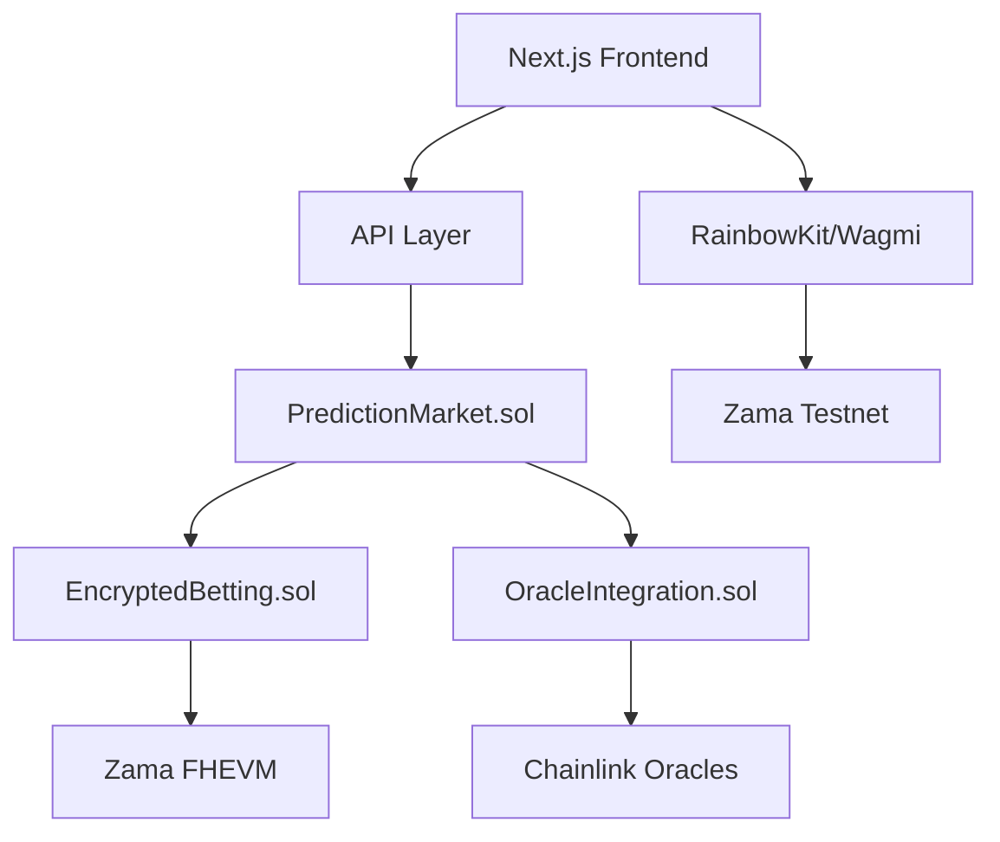

# 🔮 Secret Predictions - Private Prediction Market

> The first fully private prediction market powered by Zama FHE. Bet on events with complete confidentiality.


## 🌟 **What Makes Us Different**

Unlike [Polymarket](https://polymarket.com) and [Kalshi](https://kalshi.com), **Secret Predictions** offers:

- **🔒 Complete Privacy**: All bet amounts and positions encrypted with Zama FHE
- **🚫 No Front-Running**: Impossible to see positions before market resolution  
- **🐋 Anti-Whale Protection**: Large positions can't manipulate market sentiment
- **⚡ Fair Markets**: True price discovery without influence from visible positions

## 🎯 **Core Features**

### **Privacy-First Architecture**
- **Encrypted Betting**: All positions hidden until market resolution using Zama FHEVM
- **Anonymous Participation**: Bet without revealing your strategy or capital
- **Hidden Liquidity**: Market makers can provide liquidity privately

### **Advanced Market Types**
- **Binary Outcomes**: Simple YES/NO predictions on any event
- **Multi-Oracle Support**: Manual, Chainlink, API, and consensus resolution
- **Dispute Resolution**: Community-driven dispute mechanism for fair outcomes

### **DeFi Integration**
- **Automated Payouts**: Smart contract-based reward distribution
- **Yield Generation**: Earn on locked funds during market duration
- **Cross-Chain Support**: (Coming soon) Predict on multiple chains

## 🏗️ **Architecture**



### **Smart Contracts**

#### **PredictionMarket.sol** 
Main contract handling market creation, betting, and resolution
- Market lifecycle management
- Fee collection (3% platform fee)
- User position tracking

#### **EncryptedBetting.sol**
Handles all FHE operations for private betting
- Encrypted amount storage (`euint64`)
- Encrypted outcome storage (`ebool`)  
- Private position calculations

#### **OracleIntegration.sol**
Multi-oracle system for market resolution
- Manual oracle resolution
- Chainlink price feed integration
- Consensus-based resolution
- Dispute mechanisms

## 🚀 **Quick Start**

### **Prerequisites**
- Node.js 18+
- npm or yarn
- MetaMask or compatible wallet
- Zama testnet ETH

### **Installation**

```bash
# Clone the repository
git clone https://github.com/your-username/secret-predictions.git
cd secret-predictions

# Install dependencies
npm install
cd frontend && npm install

# Set up environment variables
cp frontend/env.example frontend/.env.local
```

### **Development**

```bash
# Start the frontend
npm run dev

# In another terminal, compile contracts
cd hardhat
npm run compile

# Deploy to Zama testnet
npm run deploy
```

### **Environment Variables**

#### **Frontend (.env.local)**
```env
NEXT_PUBLIC_WALLET_CONNECT_PROJECT_ID=your_project_id
NEXT_PUBLIC_SEPOLIA_RPC_URL=https://ethereum-sepolia-rpc.publicnode.com
NEXT_PUBLIC_PREDICTION_MARKET_ADDRESS=0xF4B4B18645c810195ef7a9bF768A0242A8325D7c
NEXT_PUBLIC_ENCRYPTED_BETTING_ADDRESS=0xB9C509d0aA9ca8B083E73531Ab06Fb81B26DC918
NEXT_PUBLIC_ORACLE_INTEGRATION_ADDRESS=0xc5cb86FfDae958B566E0587B513DC67003fefDa0
```

## 🎮 **How It Works**

### **1. Market Creation**
Anyone can create a prediction market by:
- Defining a clear question and resolution criteria
- Setting an end time for betting
- Choosing an oracle for resolution
- Paying a small creation fee

### **2. Private Betting**
Users place encrypted bets:
```solidity
function placeBet(
    uint256 marketId,
    einput encryptedAmount,
    einput encryptedOutcome,
    bytes calldata inputProof
) external payable
```

### **3. Market Resolution**
Markets are resolved through various oracle types:
- **Manual**: Trusted party resolution
- **Chainlink**: Price feed based resolution  
- **API**: External data source integration
- **Consensus**: Multi-oracle voting

### **4. Private Payouts**
Winners claim their payouts while maintaining privacy:
```solidity
function claimPayout(uint256 marketId) external
```

## 📊 **Example Markets**

### **Crypto Predictions**
- "Will Bitcoin reach $120,000 by end of 2024?"
- "Will Ethereum 2.0 staking yield exceed 5% in 2024?"

### **Political Events**  
- "Will Trump win the 2024 Presidential Election?"
- "Will Russia-Ukraine war end in 2024?"

### **Sports & Entertainment**
- "Will Lakers make NBA Playoffs 2024-25?"
- "Will a new Marvel movie gross over $1B in 2024?"

### **Technology & Business**
- "Will Apple stock reach $300 by end of 2024?"
- "Will OpenAI release GPT-5 in 2024?"

## 🔧 **Technology Stack**

### **Smart Contracts**
- **Solidity 0.8.24**: Smart contract development
- **Zama FHEVM**: Fully homomorphic encryption
- **Hardhat**: Development environment
- **OpenZeppelin**: Security standards

### **Frontend**
- **Next.js 14**: React framework with App Router
- **TypeScript**: Type-safe development
- **Tailwind CSS**: Utility-first styling
- **Framer Motion**: Smooth animations
- **RainbowKit**: Web3 wallet connections

### **Blockchain Integration**
- **Wagmi**: React hooks for Ethereum
- **Viem**: TypeScript Ethereum library
- **Zama Testnet**: FHE-enabled blockchain

## 🔐 **Privacy Guarantees**

### **What's Hidden**
- ✅ Individual bet amounts
- ✅ User position sizes  
- ✅ Betting strategies
- ✅ Win/loss ratios per user

### **What's Visible**
- ✅ Market questions and descriptions
- ✅ Total market volume
- ✅ Aggregate odds percentages
- ✅ Market resolution outcomes

### **Technical Implementation**
```solidity
struct EncryptedPosition {
    euint64 yesAmount;      // FHE encrypted
    euint64 noAmount;       // FHE encrypted  
    euint32 betCount;       // FHE encrypted
    ebool hasPosition;      // FHE encrypted
}
```

## 📈 **Tokenomics**

### **Platform Fees**
- **Market Creation**: Free
- **Betting Fee**: 3% of winnings
- **Oracle Resolution**: 0.1% of market volume

### **Revenue Distribution**
- **Platform Development**: 60%
- **Oracle Incentives**: 25%
- **Community Treasury**: 15%

## 🛣️ **Roadmap**

### **Phase 1: MVP** ✅
- [x] Core smart contracts
- [x] FHE betting implementation
- [x] Basic frontend UI
- [x] Zama testnet deployment

### **Phase 2: Enhancement** 🚧
- [ ] Advanced oracle integration
- [ ] Mobile-responsive design
- [ ] Market analytics dashboard
- [ ] Liquidity pool creation

### **Phase 3: Scaling** 📋
- [ ] Cross-chain deployment
- [ ] NFT position tokenization
- [ ] Social prediction features
- [ ] API for third-party integration

## 🔍 **Security & Audits**

### **Security Measures**
- **Smart Contract Audits**: (Planned)
- **FHE Implementation Review**: Using Zama's audited libraries
- **Multi-signature Governance**: For admin functions
- **Emergency Pause Mechanisms**: Circuit breakers for security

### **Known Limitations**
- Testnet deployment only (for now)
- Limited oracle types in initial version
- No mobile app (web-first approach)

## 👥 **Community & Support**

### **Links**
- **Website**: https://secret-predictions.com (coming soon)
- **Documentation**: https://docs.secret-predictions.com (coming soon)
- **Discord**: https://discord.gg/secret-predictions (coming soon)
- **Twitter**: @SecretPredictions (coming soon)

### **Contributing**
We welcome contributions! Please read our [Contributing Guide](CONTRIBUTING.md) for details.

### **Bug Reports**
Found a bug? Please open an issue with:
- Clear reproduction steps
- Expected vs actual behavior
- Screenshots if applicable
- Environment details

## 📄 **License**

This project is licensed under the MIT License - see the [LICENSE](LICENSE) file for details.

## 🙏 **Acknowledgments**

- **[Zama](https://zama.ai)**: For the incredible FHE technology
- **[Polymarket](https://polymarket.com)**: Inspiration for prediction market design
- **[Kalshi](https://kalshi.com)**: UI/UX inspiration for betting interfaces
- **[Ethereum](https://ethereum.org)**: For the foundational blockchain technology

---

**Built with ❤️ for the Zama Bounty Program**

*"The future of prediction markets is private"* 🔮

